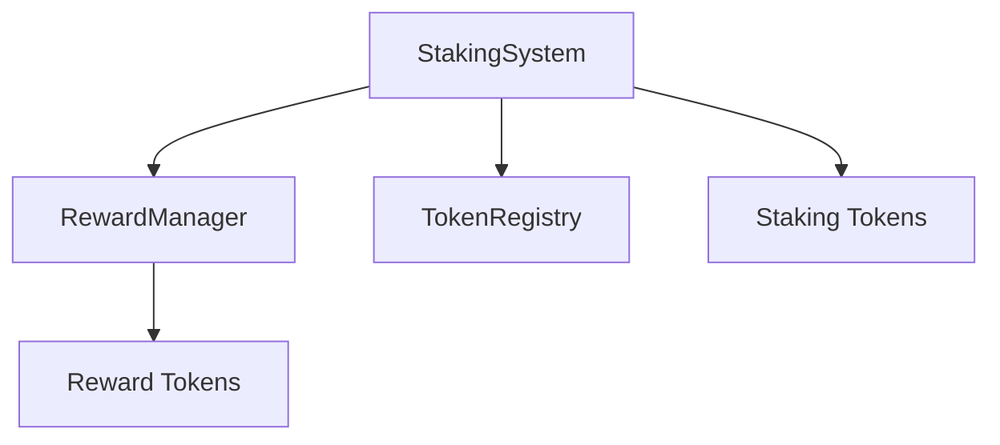

# Technical Design Document: BSC Multi-Token Staking System

## Contract Architecture

### 1. Core Contracts

#### StakingSystem.sol
```solidity
// Main contract that orchestrates the staking system
contract StakingSystem {
    // State variables
    mapping(address => mapping(address => StakingPosition)) public stakingPositions; // user => token => position
    mapping(address => TokenConfig) public tokenConfigs; // token => config
    mapping(address => bool) public isStakingToken; // token => is allowed
    mapping(address => uint256) public totalStaked; // token => amount
    mapping(address => uint256) public rewardRates; // token => rate
    
    // Structs
    struct StakingPosition {
        uint256 amount;
        uint256 startTime;
        uint256 lockEndTime;
        uint256 lastRewardTime;
        uint256 accumulatedRewards;
        bool isFixed;
    }
    
    struct TokenConfig {
        uint256 minStakeAmount;
        uint256 cooldownPeriod;
        uint256 fixedLockPeriod;
        uint256 maxRewardTokens;
        bool isActive;
    }
}
```

#### RewardManager.sol
```solidity
// Handles reward calculations and distributions
contract RewardManager {
    // State variables
    mapping(address => mapping(address => uint256)) public rewardRates; // token => rewardToken => rate
    mapping(address => uint256) public totalRewards; // rewardToken => amount
    mapping(address => uint256) public targetTVL; // token => amount
    mapping(address => uint256) public targetStakers; // token => count
    
    // Structs
    struct RewardConfig {
        uint256 baseRate;
        uint256 tvlFactor;
        uint256 stakerFactor;
        uint256 maxVariableAPY;
    }
}
```

#### TokenRegistry.sol
```solidity
// Manages token configurations and whitelist
contract TokenRegistry {
    // State variables
    mapping(address => bool) public isWhitelisted;
    mapping(address => TokenParams) public tokenParams;
    
    // Structs
    struct TokenParams {
        uint256 minStakeAmount;
        uint256 cooldownPeriod;
        bool supportsNative;
    }
}
```

### 2. State Management

#### Staking Positions
- Each user can have multiple staking positions per token
- Positions are tracked with:
  - Staked amount
  - Start time
  - Lock end time (for fixed staking)
  - Last reward calculation time
  - Accumulated rewards
  - Staking type (fixed/flexible)

#### Token Configurations
- Per-token settings:
  - Minimum stake amount
  - Cooldown period
  - Fixed lock period
  - Maximum reward tokens
  - Active status

#### Reward Management
- Reward rates per token and reward token
- Total rewards distributed
- Target TVL and staker counts
- Reward configuration parameters

### 3. Contract Interactions



#### Interaction Flow
1. **Staking Process**
   ```
   User -> StakingSystem.stake()
   ├── TokenRegistry.validateToken()
   ├── TokenRegistry.validateAmount()
   ├── StakingSystem.createPosition()
   └── RewardManager.initializeRewards()
   ```

2. **Reward Calculation**
   ```
   User -> StakingSystem.claimRewards()
   ├── RewardManager.calculateRewards()
   ├── RewardManager.updateAccumulatedRewards()
   └── StakingSystem.transferRewards()
   ```

3. **Unstaking Process**
   ```
   User -> StakingSystem.unstake()
   ├── StakingSystem.validateUnstake()
   ├── RewardManager.finalizeRewards()
   └── StakingSystem.transferTokens()
   ```

### 4. Security Measures

#### Access Control
```solidity
// Roles
bytes32 public constant ADMIN_ROLE = keccak256("ADMIN_ROLE");
bytes32 public constant OPERATOR_ROLE = keccak256("OPERATOR_ROLE");
bytes32 public constant EMERGENCY_ROLE = keccak256("EMERGENCY_ROLE");
```

#### Timelock Implementation
```solidity
struct TimelockProposal {
    uint256 executionTime;
    bytes32 operationHash;
    bool executed;
}

mapping(bytes32 => TimelockProposal) public timelockProposals;
```

### 5. Events

```solidity
// Staking Events
event Staked(address indexed user, address indexed token, uint256 amount, bool isFixed);
event Unstaked(address indexed user, address indexed token, uint256 amount);
event RewardsClaimed(address indexed user, address indexed rewardToken, uint256 amount);

// Admin Events
event TokenWhitelisted(address indexed token);
event TokenRemoved(address indexed token);
event RewardTokenAdded(address indexed token);
event RewardTokenRemoved(address indexed token);
```

### 6. Error Handling

```solidity
// Custom Errors
error InsufficientStakeAmount();
error TokenNotWhitelisted();
error CooldownPeriodActive();
error LockPeriodNotEnded();
error MaxRewardTokensReached();
error InvalidRewardRate();
error UnauthorizedAccess();
```

### 7. Gas Optimization

#### Storage Optimization
- Use uint256 for amounts (BSC is EVM compatible)
- Pack related variables in structs
- Use mappings for dynamic data
- Implement batch operations for rewards

#### Computation Optimization
- Cache frequently accessed storage variables
- Use unchecked blocks for arithmetic operations
- Implement efficient reward calculation algorithms

### 8. Testing Strategy

#### Unit Tests
- Token management
- Staking operations
- Reward calculations
- Access control
- Emergency functions

#### Integration Tests
- Contract interactions
- End-to-end staking flow
- Reward distribution
- Token transfers

#### Fuzz Tests
- Random stake amounts
- Multiple concurrent operations
- Edge cases in calculations

### 9. Deployment Strategy

#### Initialization
1. Deploy TokenRegistry
2. Deploy RewardManager
3. Deploy StakingSystem
4. Initialize configurations
5. Whitelist initial tokens

#### Verification
1. Contract verification on BSCScan
2. Initial parameter validation
3. Security checks
4. Gas optimization verification

### 10. Monitoring and Maintenance

#### Key Metrics
- Total Value Locked (TVL)
- Number of stakers
- Reward distribution
- Gas usage
- Error rates

#### Maintenance Procedures
- Regular parameter updates
- Emergency procedures
- Reward rate adjustments
- Token management 